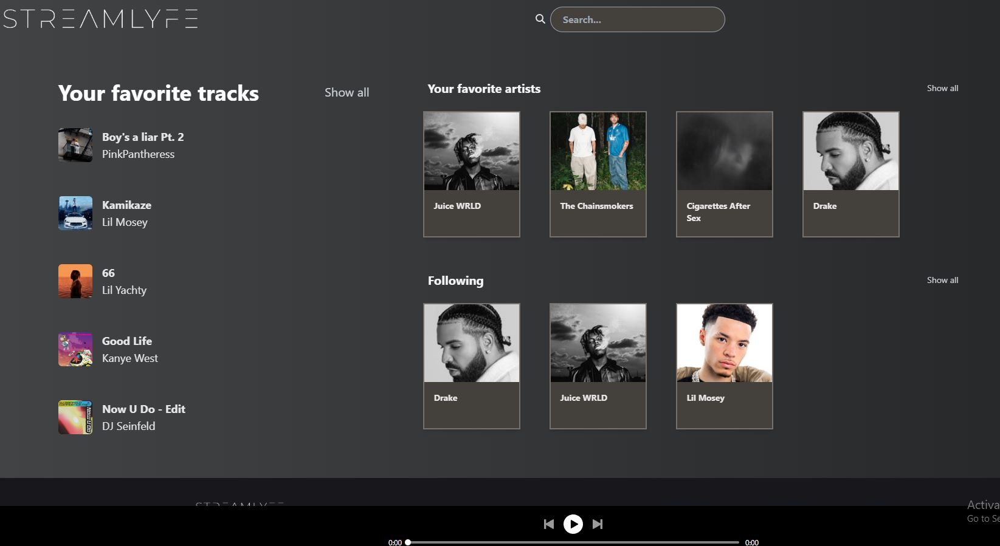
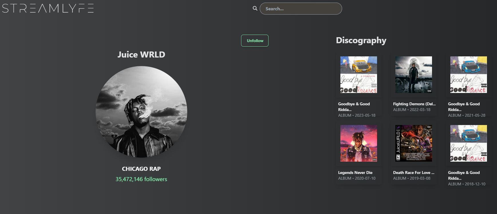
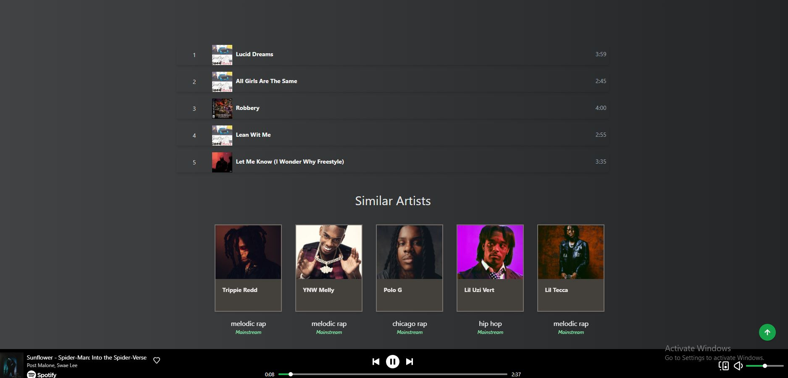

## Installation and setup
1. To use this app you must be authorized by myself. Email me at sasespirkovski@yahoo.com
2. Make sure you have the following software installed on your system:

        Node.js (version 14 or higher recommended)

        npm (Node Package Manager) 

3. Clone the repo: https://github.com/spirkovskialeksandarsasa/StreamLyfe.git
4. Run ``npm install``
5. Create a .env file containing the following:

    (Replace the CID with the client ID I email you after giving you authorization.)

        VITE_REACT_APP_CLIENT_ID=CID
        VITE_REACT_APP_SCOPES="user-read-playback-state user-modify-playback-state user-read-currently-playing app-remote-control streaming playlist-read-private playlist-read-collaborative playlist-modify-private playlist-modify-public user-follow-modify user-follow-read user-read-playback-position user-top-read user-read-recently-played user-library-modify user-library-read user-read-email user-read-private"
        
6. Run ``npm run dev``
7. Enjoy! Login with your spotify account and use the buttons to navigate across the app! For some of the features it will be required to be a spotify premium user.

## Screenshots

